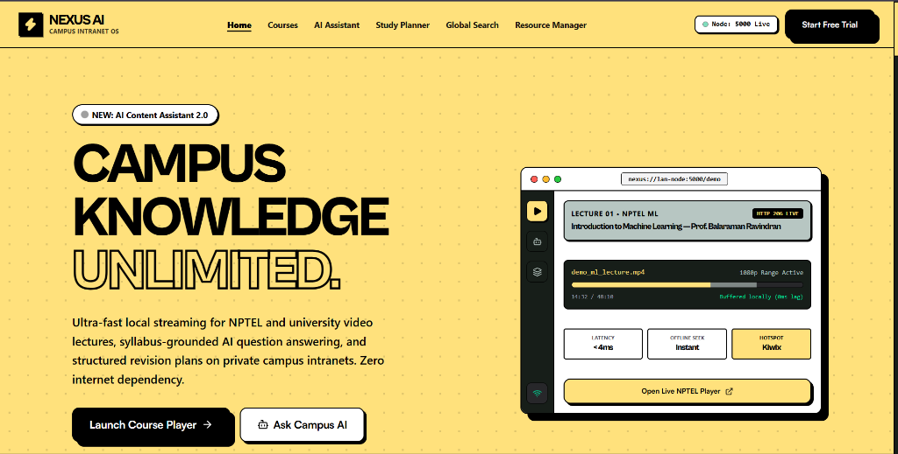
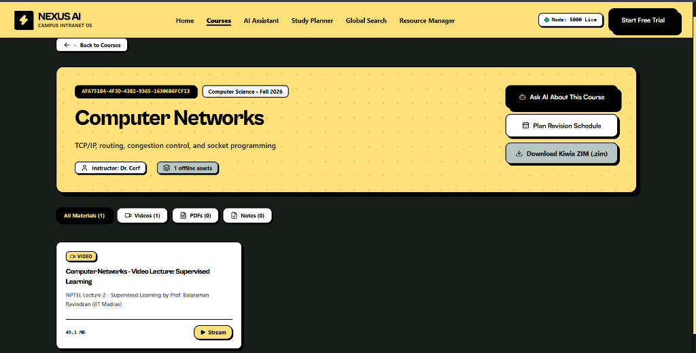

# NEXUS AI — Intelligent Offline Campus & Local Network Learning Platform

NEXUS AI is an educational platform designed to run on local university servers and offline **Kiwix Wi-Fi hotspots**. It provides course management, fast indexed search, educational resource delivery (PDFs and videos with HTTP 206 byte-range seeking), LM Studio Gemma AI integration, and Kiwix ZIM archive support.

---

## 📸 Interface Preview

### Neo-Brutalist Campus OS Landing Page


### Course Catalog & NPTEL Video Streaming Player


---

## ✨ Key Features

- **🎨 Neo-Brutalist Design System**: High-contrast `#ffe17c` yellow palette, solid 2px black borders, hard offset shadows, and typography powered by *Cabinet Grotesk* and *Satoshi*.
- **⚡ Zero-Buffering Local Video Streaming**: High-performance HTTP 206 Partial Content byte-range delivery with instant seeking on campus Wi-Fi.
- **🤖 LM Studio & Gemma 4 Integration**: On-device syllabus-grounded AI assistant powered by local Gemma inference via OpenAI-compatible API (`http://127.0.0.1:1234/v1`).
- **📦 Kiwix Offspot Hotspot Support**: Direct OpenZIM archive integration (`.zim`) enabling full offline distribution across multiple student devices over Wi-Fi without internet.
- **📚 Complete Course & Resource Management**: Upload, index, tag, and stream PDFs, slides, recitation notes, and video lectures.

---

## 🚀 Quick Start

### 1. Backend Service
```bash
cd backend
npm install
npm run build
npm start
```
> Running on **http://localhost:5000** (LAN access enabled on `0.0.0.0:5000`)

### 2. Frontend Development Server
```bash
cd frontend
npm install
npm run dev
```
> Running on **http://localhost:5173**

### 3. Docker Compose (Production / Hotspot Node)
```bash
docker compose up --build -d
```

---

## 📁 Repository Structure

- [`frontend/`](./frontend): Modern, offline-first React 19 + TypeScript + Vite + Tailwind CSS web application.
  - [`README.md`](./frontend/README.md): Frontend architectural overview and developer guide.
- [`backend/`](./backend): Node.js, Express & TypeScript backend service with SQLite database.
  - [`docs/API.md`](./backend/docs/API.md): Full REST API documentation.
  - [`Dockerfile`](./backend/Dockerfile): Multi-stage container definition.
  - [`README.md`](./backend/README.md): Detailed backend architecture and deployment guide.
- [`offspot/`](./offspot): Kiwix Offspot Raspberry Pi deployment recipe and configuration.
- [`OFFSPOT_DEPLOYMENT.md`](./OFFSPOT_DEPLOYMENT.md): Complete guide for provisioning offline Wi-Fi access points.
- [`docker-compose.offspot.yml`](./docker-compose.offspot.yml): Offspot-specific multi-service orchestration.

---

## 🎯 Verification & Testing

```bash
cd backend
npm test
```
All integration tests pass, covering health checks, course CRUD, resource uploads, HTTP Range video streaming, metadata search, and AI proxying.
